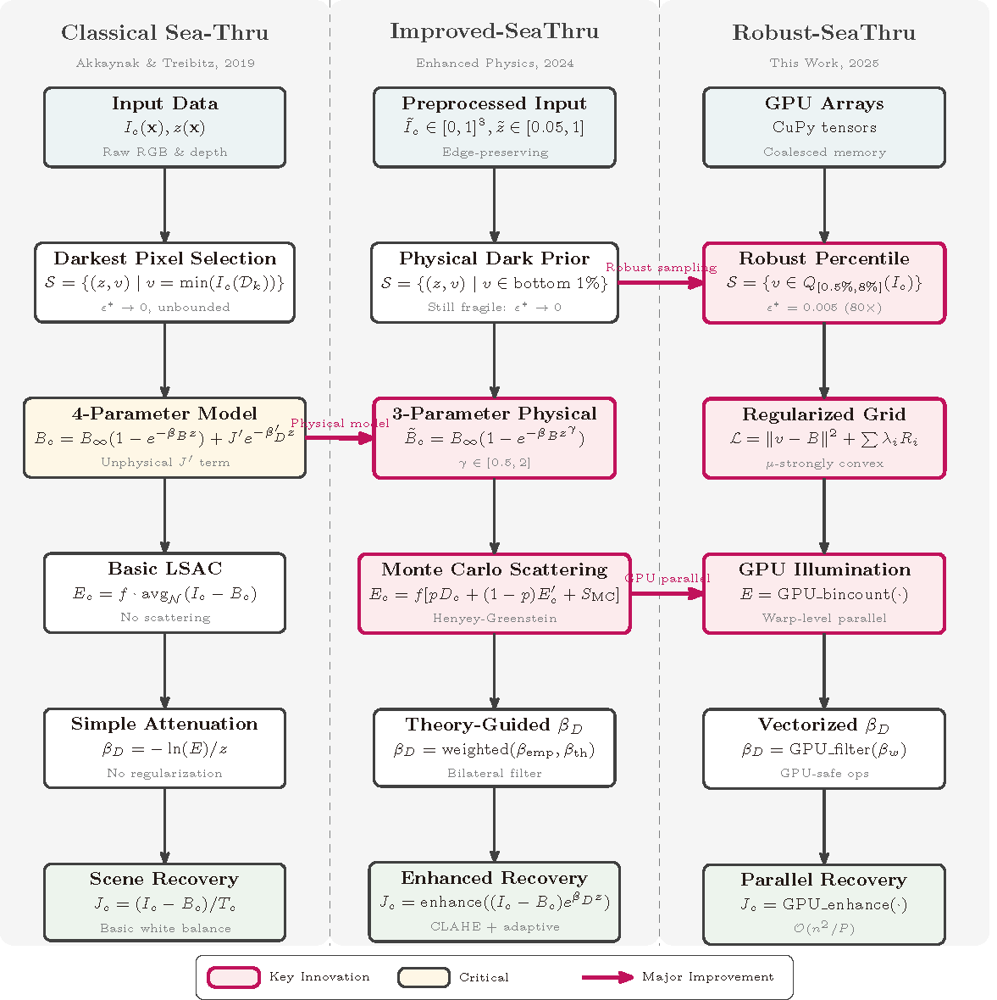

# Robust-SeaThru:A Physics-Guided Underwater Image Restoration Model with Percentile-based Backscatter Estimation

please download depthanythingv2 model by yourself

thank you very much

results dataset: https://drive.google.com/file/d/1cvfuC0ChV_xDRXMixqC653rsgj-X0MOW/view?usp=sharing

Dr. Jinxin Shao
2025/7/8

